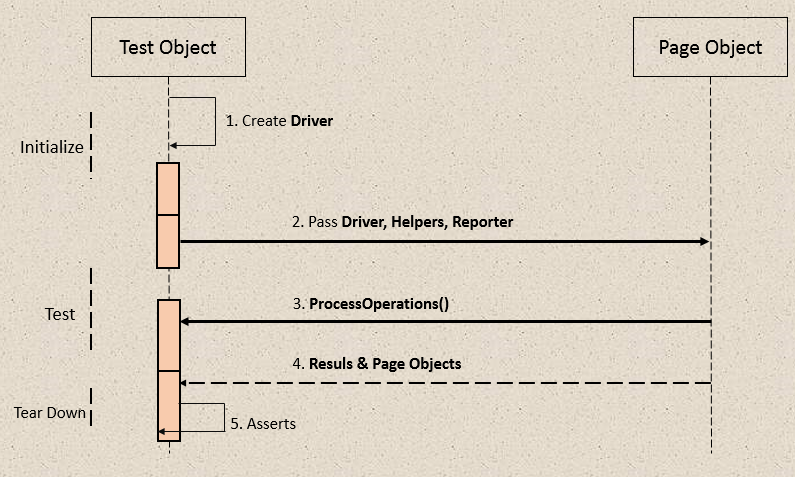
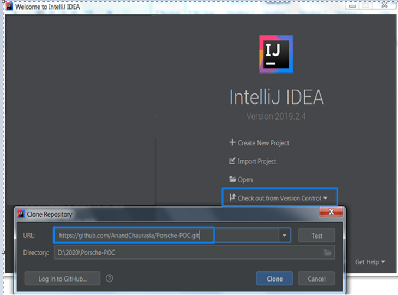
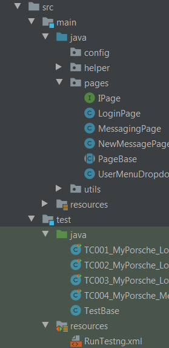

# Digitalcommunication (Project) Proof of Concept 

### Overview

Creating tests for POC for UI Web based applications using Selenium libraries have three parts:

* Locating all UI elements
* To perform Operations on these elements and additionally assert some specific conditions
* Reporting execution result for different stakeholder

To address these issues, I have taken the approach of formalizing a Design Pattern called Page Object Model (POM)

The POM design pattern dictates that there should be a separation between test classes and pages (business objects). This methodology allows test projects to decouple responsibilities (Tests Vs Page logic) and expand their projects rapidly.

The diagram below depicts the interaction between Test and a Page Object

### Setup project on Local machine
Install Java JDK 11 on your machine. Start IntelliJ and import project as Git 

  

*	URL of Git is https://github.com/AnandChaurasia/Porsche-POC.git

*	 Refresh Gradle present on right side corner to load all dependencies

* Structure for a POM based project 

  

###Execution: 
-	Gradlew clean
-	Gradlew run

###Reporting: 

  

###Summary
Page Object Model is a way to develop tests for UI applications. Some of the advantages of using POM are as follows:

* Makes Test Suites more structured and easily maintainable and reusable
* The core strategy is to separate UI Locator logic to Page Objects and Test logic to Test Objects
* All the UI properties are defined in pages which will help better categorization
* Makes tests more readable

